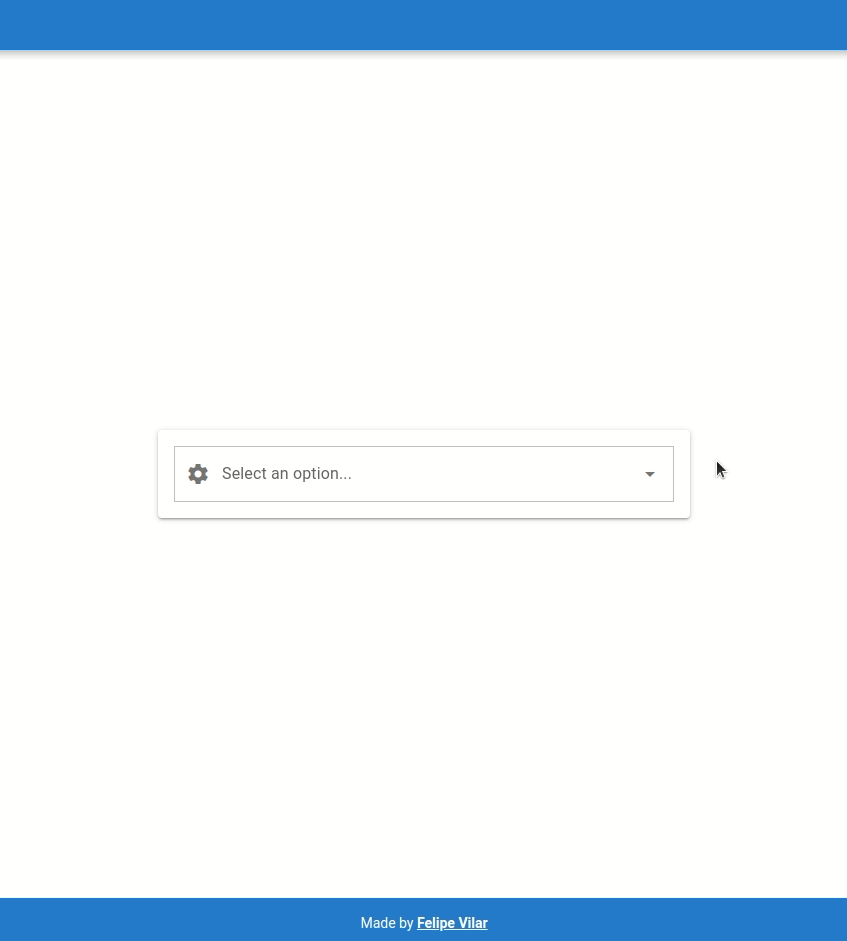
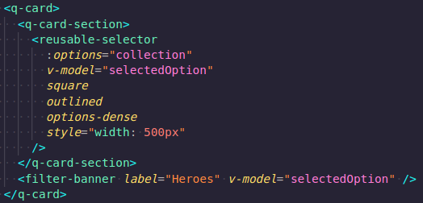

# Reusable QSelect (nice-reusable-quasar-select)

Simple and Beautiful Reusable Quasar QSelect and Banner

## Install the dependencies
```bash
yarn
# or
npm install
```

### Start the app in development mode (hot-code reloading, error reporting, etc.)
```bash
quasar dev
```

## Appearance



## Usage in Component

